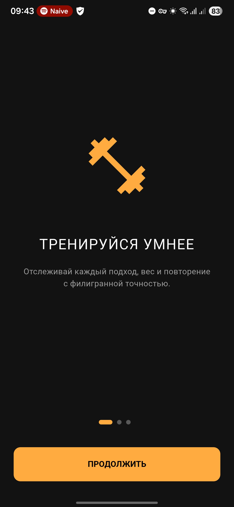
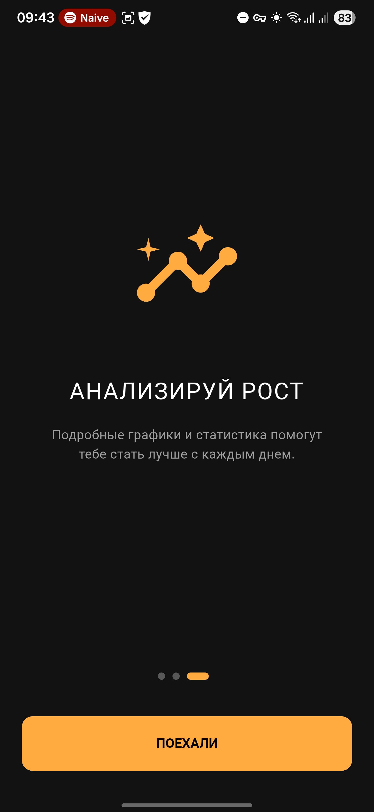
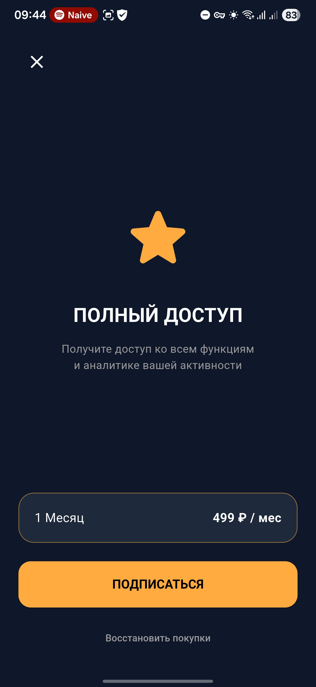
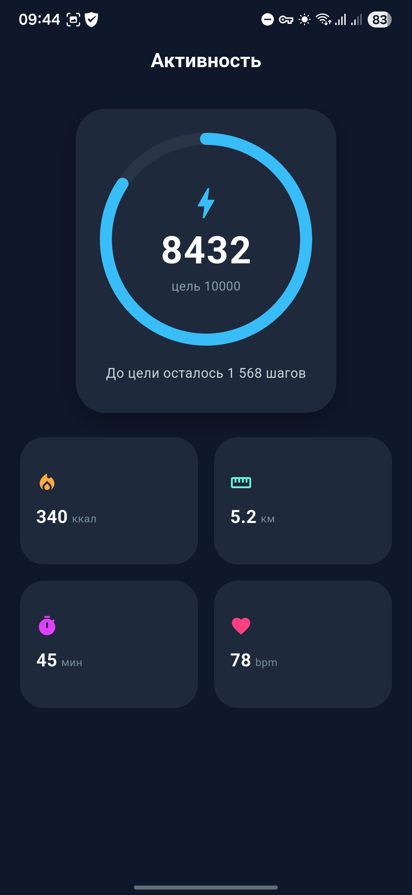

🟢 Fitness App Concept (Peak Level)

Проект представляет собой MVP фитнес-трекера с системой онбординга, пейволлом и экраном статистики активности в темной теме.

    Архитектура

В приложении реализована сервис-ориентированная архитектура с разделением логики и интерфейса:

UI Layer (Presentation): Виджеты Flutter (Stateless/Stateful), отвечающие только за отрисовку данных.

Service Layer (Data Access): Отдельный класс StorageService, который инкапсулирует работу с локальным хранилищем (SharedPreferences).

Logic (Main/Navigation): Логика "ветвления" в main.dart, которая определяет состояние приложения при холодном старте (Flow Control).

    Структура проекта

`lib/`
├── `main.dart`                # Инициализация приложения, глобальная тема и логика запуска
├── `services/`                # Слой данных и внешних API
│   └── `storage_service.dart` # Локальное хранилище (SharedPreferences)
├── `screens/`                 # Пользовательский интерфейс (экраны)
│   ├── `onboarding_screen.dart` # Приветственные экраны
│   ├── `paywall_screen.dart`    # Экран монетизации
│   └── `steps_statistics.dart`  # Основной дашборд пользователя
└── `mocks/`                   # Тестовые данные для разработки
└── `onboarding_mock.dart`   # Контент для онбординга

    Что бы я улучшил (Backlog на будущее)

Если бы у меня было больше времени, я бы реализовал следующие технические решения:

State Management (Управление состоянием):

    Внедрил бы Provider или BLoC для управления данными шагов. Сейчас данные статичны, а со стейт-менеджментом цифры бы обновлялись в реальном времени во всем приложении.

Dependency Injection (DI):

    Использовал бы пакет get_it для регистрации StorageService. Это позволило бы не инициализировать его каждый раз через await, а получать доступ к нему мгновенно из любой точки кода.

Анимации:

    Добавил бы пакет Lottie для онбординга и анимировал бы счетчик шагов от 0 до текущего значения при загрузке экрана.

Backend & Health Integration:

    Подключил бы Google Fit / Apple Health API через плагины, чтобы получать реальные данные с датчиков телефона.

    Добавил бы Firebase для авторизации и сохранения прогресса в облаке.

Тестирование:

    Написал бы Unit-тесты для StorageService и Widget-тесты для проверки корректности переходов между экранами.

### Проект над которым поработал подольше:

https://github.com/John-1-1-1/my_peak_level

## Экраны

### Onboarding:

### Paywall:
 

### Main:
 
